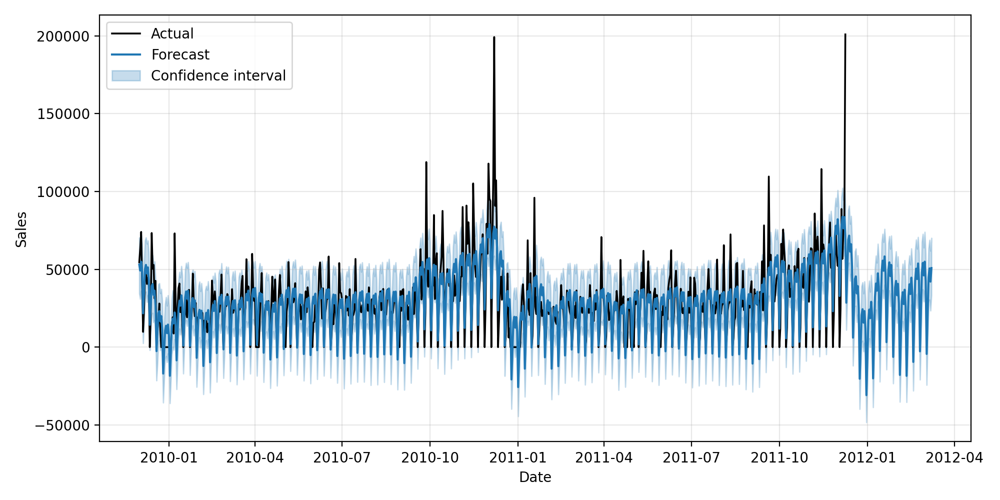
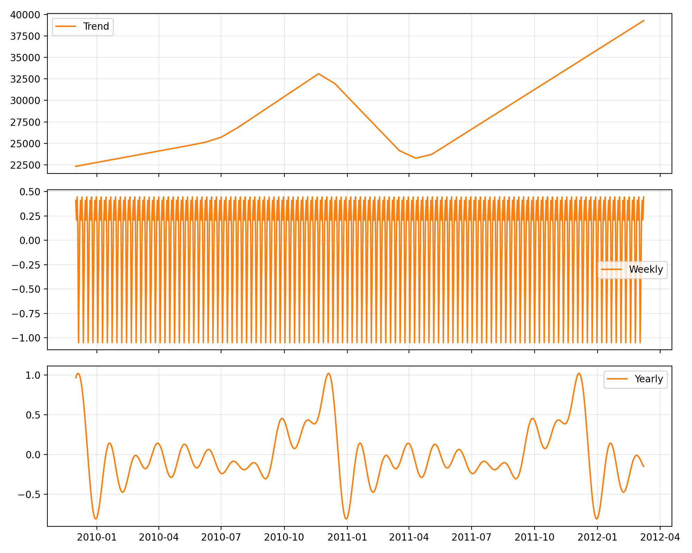

# Project Overview
- **Name:** `forecast_online_retail_prophet`
- **Goal:** Build a Prophet-based forecasting workflow for the `online_retail_II.csv` dataset, covering preprocessing, model tuning, evaluation, and visualization using modular `src/` code plus five Jupyter notebooks.
- **Key Features:** Memory-safe data loading, Prophet hyperparameter search with persistence, common regression metrics, Matplotlib-based diagnostics, and reusable utilities for config/logging.

## Repository Layout
- `src/utils.py` – YAML/config loaders, logging helper factory, filesystem I/O utilities.
- `src/data_prep.py` – Raw transaction ingestion, cleansing, sales aggregation, timezone placeholder, and daily/monthly export helpers.
- `src/prophet_pipeline.py` – Frame coercion, Prophet builder (with tuned configs), training + forecasting pipeline, and model persistence.
- `src/prophet_config.py` – Grid-search tuner with MAE scoring, history tracking, and JSON save/load of best parameters.
- `src/evaluate_model.py` – MAPE/MAE/RMSE calculators, forecast-frame evaluation, and cross-validation summary stub.
- `src/visualize_results.py` – Forecast vs. actual plotter and Prophet component charts with safe datetime casting.
- `notebooks/01_data_preprocessing.ipynb` → `05_visualization_dashboard.ipynb` – Sequential workflow: data prep, aggregation, modeling/tuning, evaluation, visualization.
- `config/` – Stores YAML parameters and the tuned `best_prophet_config.json`.
- `models/` & `results/` – Persist trained Prophet models, metrics, plots, and forecast CSVs.

## Prerequisites
1. Python ≥ 3.10 (virtual environment recommended).
2. Dependencies in `requirements.txt` (Prophet, pandas, scikit-learn, matplotlib, pyyaml, joblib, etc.).
3. Dataset `online_retail_II.csv` placed in `data/raw/` (update paths in `config/data_paths.yaml` if needed).

### Environment Setup
```bash
python -m venv env
source env/bin/activate  # Windows: env\Scripts\activate
pip install -r requirements.txt
```

## Usage Workflow
1. **Configure paths:** Adjust YAML files under `config/` to match local data locations and output directories.
2. **Run notebooks in order:**
   - `01_data_preprocessing.ipynb` – Loads raw CSV (chunked if needed), cleans transactions, and generates aggregated daily/monthly frames under `data/processed/`.
   - `02_feature_engineering.ipynb` – Applies any additional derived features or filters using functions inside `src/data_prep.py`.
   - `03_prophet_modeling.ipynb` – Calls `search_best_prophet_config` (holdout MAE), saves `config/best_prophet_config.json`, then trains Prophet via `run_pipeline` and writes the model with `save_model`.
   - `04_model_evaluation.ipynb` – Aligns forecasts with actuals, computes metrics through `evaluate_forecast_frame`, and stores summary CSV/JSON in `results/`.
   - `05_visualization_dashboard.ipynb` – Generates forecast overlays and Prophet component plots via `visualize_results`, saving PNG artifacts to `results/plots/`.
3. **Command-line execution (optional):** Wrap notebook logic in scripts if batch automation is desired; the modular `src/` functions enable straightforward reuse.

## Key Implementation Notes
- **Datetime Safety:** Every merge/join involving `ds` ensures `pd.to_datetime` casting to avoid dtype mismatches.
- **Memory Handling:** `load_raw_transactions` uses explicit dtypes and chunked loading fallback to prevent `MemoryError`.
- **Tuning Persistence:** Once `best_prophet_config.json` exists, `run_pipeline` automatically applies those parameters unless overridden.
- **Evaluation Hygiene:** `evaluate_forecast_frame` drops rows with missing actuals/predictions before computing metrics to avoid NaNs.
- **Visualization Defaults:** Plotting utilities set styles and axis formats internally; simply pass the forecast and actual frames.

## Troubleshooting
- **NaNs in metrics:** Confirm both actual and forecast frames share identical date ranges and datatypes before calling `evaluate_forecast_frame`.
- **Merge dtype errors:** Ensure any custom preprocessing preserves `ds` as datetime; use `prepare_prophet_frame` or the coercion inside `run_pipeline`.
- **Large CSV issues:** Verify the dataset resides locally, and consider increasing available memory or reducing chunk sizes in `load_raw_transactions`.

## Extending the Project
- Add holiday/custom regressors by enhancing `_build_prophet`.
- Implement additional model families (ARIMA, XGBoost) under new modules for benchmarking.
- Turn notebooks into CLI workflows (e.g., `python -m src.cli`) for scheduled runs.

## Screenshots




With the notebooks executed sequentially and the `config/best_prophet_config.json` populated, you’ll have a fully tuned Prophet model, evaluation metrics, and publication-ready visualizations ready for reporting or deployment.